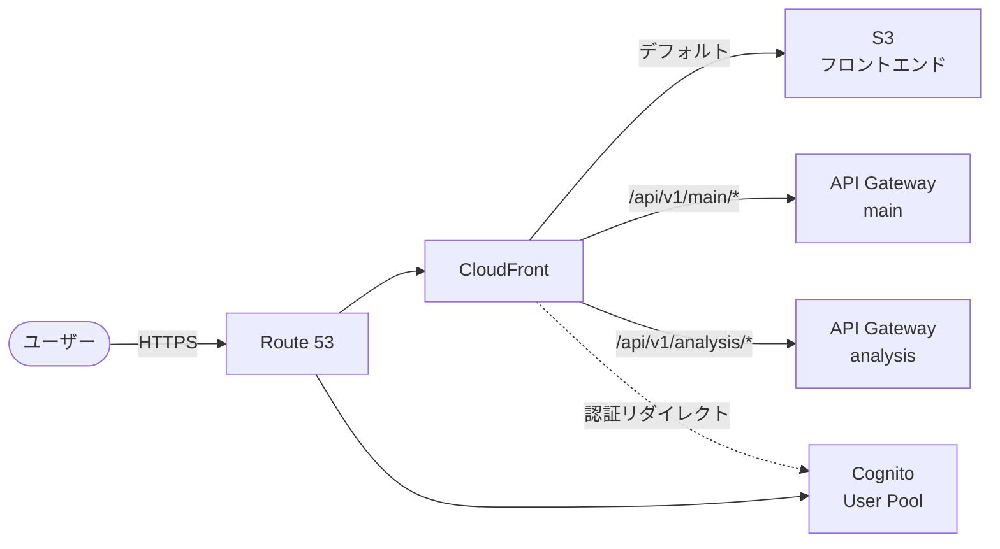

# CDK 構成

## アーキテクチャ図

## 環境

| ENV 値 | 用途 | ドメイン |
|---|---|---|
| `dev` | 開発環境 | `shogi-dev.example.com` |
| `pro` | 本番環境 | `shogi.example.com` |

## 環境変数

| 変数名 | 説明 |
|---|---|
| `ENV` | 環境識別子（`dev` / `pro`） |
| `CDK_DEFAULT_REGION` | デプロイリージョン（デフォルト: `ap-northeast-1`） |
| `DOMAIN_NAME` | カスタムドメイン名 |
| `ACM_CERTIFICATE_ARN` | ACM 証明書 ARN（us-east-1） |
| `HOSTED_ZONE_NAME` | Route 53 ホストゾーン名 |
| `COGNITO_AUTH_DOMAIN` | Cognito カスタムドメイン名 |
| `COGNITO_CERTIFICATE_ARN` | Cognito 用 ACM 証明書 ARN（us-east-1） |

## CDK コンテキスト変数

| キー | 型 | 説明 |
|---|---|---|
| `backends_deployed` | `bool` | バックエンドスタックがデプロイ済みか（IC-1.1） |
| `allowed_ips` | `string` | CloudFront IP 制限（カンマ区切り。空=制限なし）（IC-2.5） |

---

## スタック一覧

| スタック名パターン | クラス | 管理リソース |
|---|---|---|
| `stack-sgp-{env}-infra-distribution` | `DistributionStack` | S3 + CloudFront + Route 53 |
| `stack-sgp-{env}-infra-cognito` | `CognitoStack` | Cognito User Pool + カスタムドメイン |

### スタック依存関係

| 依存元 | 依存先 | 理由 |
|---|---|---|
| `CognitoStack` | `DistributionStack` | Cognito カスタムドメインの A レコード作成に親ドメインの A レコードが必要 |

---

## DistributionStack

### リソース一覧

| 論理 ID | AWS リソース種別 | 物理名パターン | 説明 | 参照 |
|---|---|---|---|---|
| `FrontendBucket` | `S3::Bucket` | `s3-sgp-{env}-infra-frontend` | フロントエンド静的ファイル | IC-2.1, IC-2.6 |
| `Certificate` | `ACM::Certificate`（参照） | — | 外部参照（`acm_certificate_arn`） | IC-1.2 |
| `ViewerRequestFunction` | `CloudFront::Function` | `cf-func-sgp-{env}-viewer-request` | SPA fallback + IP 制限 | IC-2.4, IC-2.5 |
| `Distribution` | `CloudFront::Distribution` | — | SPA 配信 + API プロキシ | IC-2.1〜2.5, IC-2.7 |
| `HostedZone` | `Route53::HostedZone`（参照） | — | 外部参照（`hosted_zone_name`） | IC-1.2 |
| `AliasRecord` | `Route53::ARecord` | `{domain_name}` | CloudFront エイリアス | — |

### CloudFormation エクスポート

| エクスポート名 | 値 | 用途 |
|---|---|---|
| `sgp-{env}-infra-S3BucketName` | S3 バケット名 | フロントエンドアップロード先（UC-2.3） |
| `sgp-{env}-infra-CloudFrontDistributionId` | ディストリビューション ID | キャッシュ無効化（UC-2.3） |
| `sgp-{env}-infra-DomainName` | ドメイン名 | 参照用（UC-2.3） |

---

## CognitoStack

### リソース一覧

| 論理 ID | AWS リソース種別 | 物理名パターン | 説明 | 参照 |
|---|---|---|---|---|
| `UserPool` | `Cognito::UserPool` | `userpool-sgp-{env}-infra` | ユーザープール | IC-3.1 |
| `CognitoCertificate` | `ACM::Certificate`（参照） | — | 外部参照（`cognito_certificate_arn`） | IC-1.2 |
| `CognitoDomain` | `Cognito::UserPoolDomain` | `{cognito_auth_domain}` | カスタムドメイン | — |
| `HostedZone` | `Route53::HostedZone`（参照） | — | 外部参照（`hosted_zone_name`） | IC-1.2 |
| `CognitoAliasRecord` | `Route53::ARecord` | `{cognito_auth_domain}` | Cognito カスタムドメインエイリアス | — |
| `UserPoolClient` | `Cognito::UserPoolClient` | `client-sgp-{env}-infra` | SPA 用クライアント | IC-3.2, IC-3.3, UC-2.1 |

### CloudFormation エクスポート

| エクスポート名 | 値 | 用途 |
|---|---|---|
| `sgp-{env}-infra-CognitoUserPoolArn` | User Pool ARN | バックエンドスタック参照（UC-2.1） |
| `sgp-{env}-infra-CognitoUserPoolId` | User Pool ID | フロントエンド設定値（UC-2.3） |
| `sgp-{env}-infra-CognitoClientId` | Client ID | フロントエンド設定値（UC-2.3） |
| `sgp-{env}-infra-CognitoDomain` | Cognito ドメイン名 | フロントエンド設定値（UC-2.3） |
